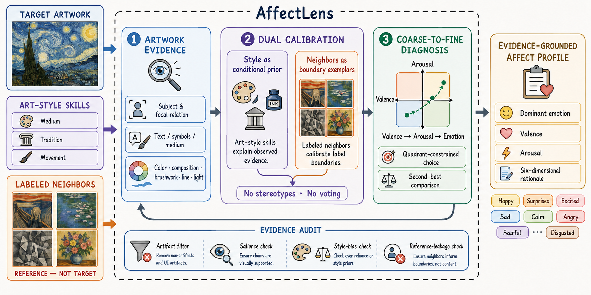

# AffectLens


[](LICENSE)

Evidence-grounded emotion understanding for artwork.

## 📢 News

🥈🥈🥈 We won the **second place** in the Understanding Track of the ACM MM26 Challenge AffectiveArt.

## Authors

* [Xiaodong Lin](https://github.com/Lixxx1)<sup>1</sup>,
  Sirui Chen<sup>1</sup>,
  Yukai Liu<sup>1</sup>,
  [Yuxiang Lin](https://lum.is-a.dev/)<sup>2†</sup> (Project Lead),
  [Zebang Cheng](https://scholar.google.com/citations?user=-fG3MhYAAAAJ&hl=zh-CN)<sup>3</sup>,
  and [Fei Ma](https://github.com/GML-MMGroup)<sup>3</sup>
* <sup>1</sup>[Sun Yat-sen University](https://www.sysu.edu.cn/sysuen/), <sup>2</sup>Independent Researcher,
  and <sup>3</sup>[Guangming Laboratory](https://www.gml.ac.cn/)

## 🗺️ Overview



AffectLens combines:

1. art-style skills;
2. an auxiliary multi-feature classifier;
3. few-shot references retrieved by three visual encoders;
4. vision-language inference with valence-arousal validation.

The preparation steps below must be completed before inference.

## Installation

```bash
python3 -m venv .venv
source .venv/bin/activate
python3 -m pip install -r requirements.txt
codex login
```

## Preparation

### 1. Install the Art-Style Skills

The repository includes 56 art-history and art-style skills:

```bash
mkdir -p ~/.codex/skills
cp -R plugins/affectlens-art-skills/skills/. ~/.codex/skills/
```

Start a new Codex session after installation.

### 2. Train the Auxiliary Model

Prepare label files and aligned NPZ features containing `x` and `image_ids`,
then train the multi-feature fusion classifier:

```bash
python3 code/multifeature_fusion/train_multifeature_fusion.py \
  --config configs/fusion.example.json \
  --train-jsonl data/train.jsonl \
  --val-jsonl data/val.jsonl \
  --train-feature clip=data/features/train/clip.npz \
  --train-feature eva=data/features/train/eva.npz \
  --train-feature dinov3=data/features/train/dinov3.npz \
  --val-feature clip=data/features/val/clip.npz \
  --val-feature eva=data/features/val/eva.npz \
  --val-feature dinov3=data/features/val/dinov3.npz \
  --output-dir outputs/fusion
```

Place the input artworks in `data/inference/images/`, then generate the
inference manifest and auxiliary predictions:

```bash
python3 code/multifeature_fusion/build_inference_manifest.py

python3 code/multifeature_fusion/predict_multifeature_fusion.py \
  --manifest-jsonl data/inference/manifest.jsonl \
  --feature clip=data/features/inference/clip.npz \
  --feature eva=data/features/inference/eva.npz \
  --feature dinov3=data/features/inference/dinov3.npz \
  --checkpoint outputs/fusion/best_model.pt \
  --output-dir outputs/fusion/inference
```

### 3. Generate Few-Shot References

Retrieve neighbors with CLIP-H/14, CLIP-L/14, and DINOv3:

```bash
for encoder in clip_h14 openai_clip_l14_hf dinov3_vit7b16; do
  python3 code/knowledge_retrieval_pipeline/scripts/retrieve_references.py \
    --model-name "$encoder" \
    --query-features "data/features/inference/${encoder}.npz" \
    --pool-features "data/features/pool/${encoder}.npz" \
    --query-jsonl data/inference/manifest.jsonl \
    --pool-jsonl data/reference_pool.jsonl \
    --output-dir "outputs/retrieval/${encoder}"
done
```

Merge the three retrieval results and export four references per artwork:

```bash
python3 code/knowledge_retrieval_pipeline/scripts/build_reference_consensus.py \
  --clip outputs/retrieval/clip_h14/clip_h14_top10.jsonl \
  --openai-clip outputs/retrieval/openai_clip_l14_hf/openai_clip_l14_hf_top10.jsonl \
  --dinov3 outputs/retrieval/dinov3_vit7b16/dinov3_vit7b16_top10.jsonl \
  --output-dir outputs/retrieval/consensus \
  --min-keep 4

python3 code/knowledge_retrieval_pipeline/scripts/export_reference_folders.py \
  --index-jsonl outputs/retrieval/consensus/reference_consensus.jsonl \
  --output-dir outputs/references \
  --max-images 4
```

## Inference

After all preparation steps are complete:

```bash
python3 code/final_inference/run_inference.py \
  --auxiliary-predictions outputs/fusion/inference/predictions.jsonl \
  --all \
  --overwrite
```

Results are written to `results.json`.

## License

This project is released under the [MIT License](LICENSE).
